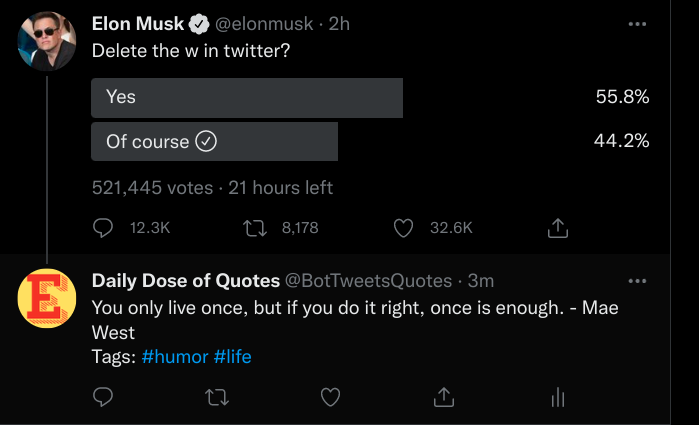
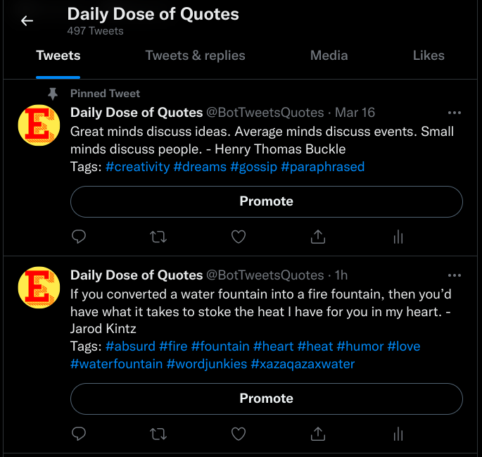

# Daily Dose of Quotes: <a href="https://twitter.com/BotTweetsQuotes">Twitter Bot</a>

> ### Tweets inspiring and motivational quotes every 2 hours! Replies to the tweets of specified users as soon they post a new tweet.

### Table of contents

[Technologies](#technologies)\
[Python Libraries](#python-libraries)\
[Description](#description)\
[Images](#images)\
[Tweet Limit Calculation](#tweet-limit-calculation)\
[Tracked Users](#tracked-users)

#### Technologies:

• Python • MongoDB • Heroku • Twitter API v2 • Git

#### Python Libraries:

• tweepy • MongoDB Atlas API • PYgithub • requests • loadenv • multithreading

## Description

A Python-based Twitter bot that uses the Twitter API endpoint to tweet a motivational quote every 2 hours while tracking a list of users to reply to their latest tweet with a random quote.\
**Technology**: Python, MongoDB, Heroku, Git.

**Detailed Description**

- The Twitter bot running on Heroku uses a 50 thousand tweets database hosted on MongoDB Atlas to post tweets every 2 hours.
- The tweets are cleaned and formatted properly to show the author's name, tags, and other info while not exceeding the tweet character limit.
- Simultaneously, it tracks the list of users from a MongoDB Atlas database where it also maintains the latest ID of the tweet of the specific user.
- As soon as the user tweets, within 5 minutes, the bot replies to them with a new random quote. Then, it updates the ID of the tweet for future purposes.
- All in all, On the first thread, the bot tweets a random quote on its profile every 2 hours and then sleeps.
- Simultaneously, the second thread checks the tweet ID every 5 minutes and if a new tweet is found, replies to it.

**My Learnings**

- Used a database of 50k quotes hosted on MongoDB, and fetched specific quotes from MongoDB Atlas web API using the python requests library.
- Implemented tweet tracking by storing tweet IDs in MongoDB Database, bot updates the tweet ID every time a targeted user tweets, to which the bot replies.
- Worked with the Tweepy library to GET and POST data via the Twitter V2 endpoint API.
- Deployment on Heroku with worker dyno running all processes simultaneously using python multithreading, also developed a CI/CD pipeline using Heroku CLI.
- I interacted with the API of Twitter to post and retrieve data, and MongoDB Atlas to save and update data.
- Moreover, I created a lot of logical syntaxes to solve problems like
  - getting a random quote from 50k quotes efficiently.
  - tracking a list of users and only reply to un-replied/latest tweets
  - modifying data into a human-readable tweet
  - keeping the tokens and private files encrypted
  - develop a CI/CD pipeline for the hassle-free deployment of production code
  - along with maintaining failsafe git versions.

## Images

## Tweet Limit Calculation

max tweets allowed: $500,000$\
bot scans all day with $5$ tweets per scan.\
let the time interval between each scan be: $x$\
let the no. of users we want to track be: $y$

$$\therefore y = {x * MaxTweets \over Days*Hours*Minutes*TweetsPerScan}$$

$$y = {500000 * x \over 31*24*60*5}$$

$$\rArr y = 2.24x$$
$\therefore$ Less the time interval, less the no of tracked users & vice versa.

$So$ with 5 minute interval, ie: $x = 5$
$$\rArr y = 2.24*5 \approx 11$$

_$\therefore$ Currently tracking **11** users._

## Tracked Users

Bot tracks the most famous personalities on twitter.

1. Adam Grant
2. Elon Musk
3. Narendra Modi
4. NASA
5. Amitabh
6. spaceX
7. Ronaldo
8. isro
9. Joe biden
10. Barack Obama
